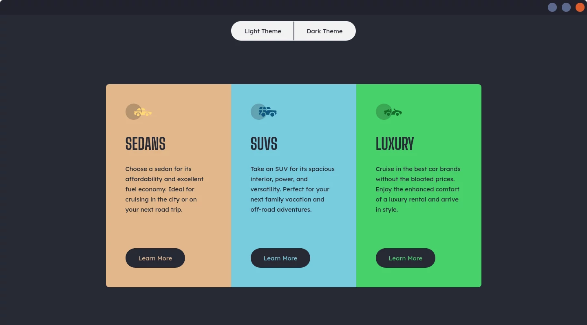

# Frontend Mentor - 3-column preview card component

This is a solution to the [3-column preview card component challenge on Frontend Mentor](https://www.frontendmentor.io/challenges/3column-preview-card-component-pH92eAR2-).

## Links

- Solution URL: [GitHub](https://github.com/Michal-Majchrzak/fm-3-column-preview-card-component)
- Live Site URL: [GitHubPages](https://michal-majchrzak.github.io/fm-3-column-preview-card-component/)

## Preview

### Mobile

Uicons by [Flaticon](https://www.flaticon.com/uicons)

### Desktop

## Built with

- HTML5 markup
- CSS & Sass
- JavaScript
- Responsive layout
- Mobile-first workflow
- Dark theme inspired by [DraculaTheme](https://draculatheme.com/)

## Author

- Frontend Mentor - [@Michal-Majchrzak](https://www.frontendmentor.io/profile/Michal-Majchrzak)